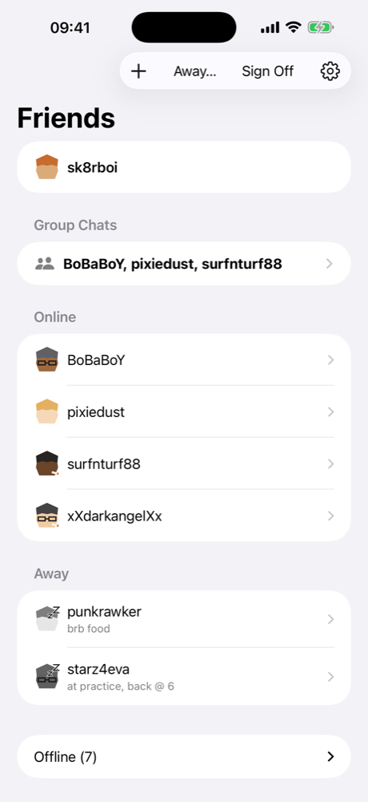
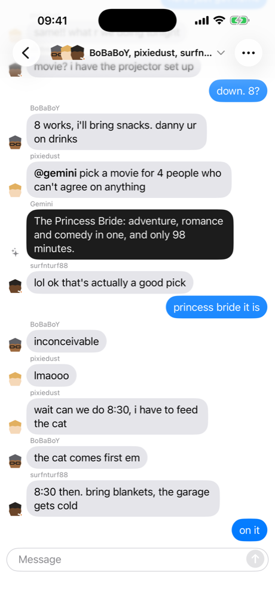
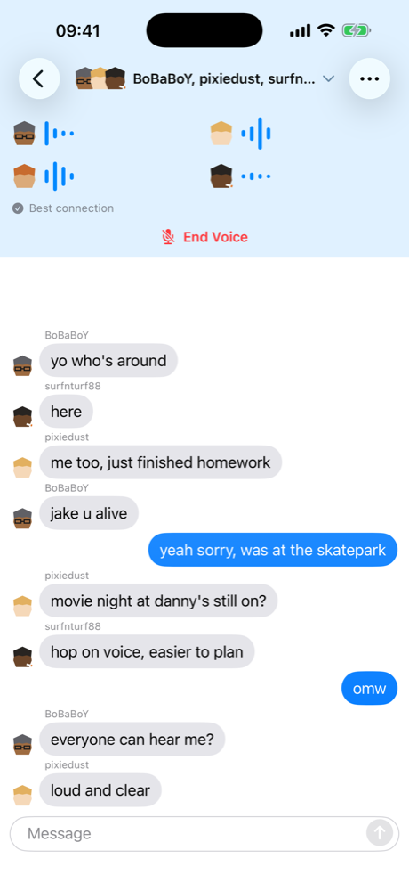
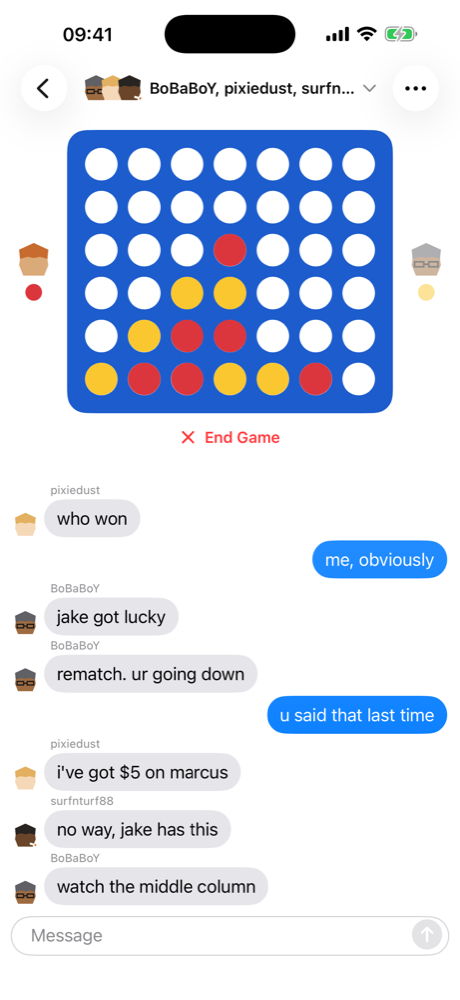

# Totem

An AIM-style buddy list for iOS and macOS. You sign on, your friends see you,
you set an away message, and conversations exist only while both of you are
online. Messages, voice, and shared activities travel directly between devices;
the server only knows who is online and who is friends with whom.

<p align="center">
  
  
  
  
</p>

## What it does

- **Presence** is deliberate. Signing on is an explicit act, away messages are
  a first-class field, and the app icon badge counts how many friends are
  online rather than unread messages.
- **Conversations are ephemeral.** Nothing is stored on the server. A transcript
  lives in memory for the length of your own online session and is gone when
  you sign off.
- **Peer to peer.** Each device runs a QUIC endpoint (via [iroh](https://github.com/n0-computer/iroh)).
  Messages, typing, live voice (Opus, 20 ms frames), and stage traffic go
  straight between participants. The server introduces peers and nothing else.
- **A shared stage** at the top of every chat: a synchronized YouTube player, or
  a game of Connect Four. Whoever starts it hosts it; everyone else sends
  actions to the host and renders what comes back.
- **Bots** are server-side services tagged in a message (`@gemini …`). A tag is
  the only thing the server ever sees of a conversation.
- **macOS** gets one window per conversation and a menu bar presence item.

## Layout

```
TotemKit/   Shared Swift package: DTOs, wire frames, pure state machines, tests
Server/     Vapor server: auth, buddies, presence gateway, bots, pushes
Apps/       SwiftUI multiplatform client (iOS 17.5+, macOS 14.5+), xcodegen project
docs/       Architecture notes and deployment
```

See [docs/architecture.md](docs/architecture.md) for how the pieces fit and the
constraints that shaped them.

## Running it

Requirements: Xcode 16+, [xcodegen](https://github.com/yonaskolb/XcodeGen), and
`redis-server` on the machine running the server.

```sh
# Shared package tests
cd TotemKit && swift test

# Server on 0.0.0.0:9047 (see .env.example for optional variables)
Server/run.sh

# Apps
cd Apps && xcodegen generate
xcodebuild -project Totem.xcodeproj -scheme Totem-macOS -configuration Debug build
xcodebuild -project Totem.xcodeproj -scheme Totem-iOS -destination "generic/platform=iOS" \
    -configuration Debug TOTEM_TEAM_ID=<your team> build
```

The scripts read optional settings from a `.env` file at the repo root; see
`.env.example`. Sign in with any handle; auth is a development handle login and Sign in with
Apple is not implemented yet. The simulator and the macOS app reach the server
on loopback. For a physical phone, pass `TOTEM_DEV_SERVER_URL` (for example
`http://your-mac.local:9047`) to the build, or type the URL on the sign-in
screen; `Apps/install.sh` wraps the build-and-install step.

Two things about the dev machine that are easy to lose an afternoon to:

- The server binary is codesigned in `run.sh` because the macOS application
  firewall silently blocks LAN connections to an unsigned binary after every
  rebuild. Loopback still works, so only the phone appears broken. Set
  `SERVER_CODESIGN_IDENTITY` to a stable identity to keep the allowance.
- Use `127.0.0.1`, not `localhost`. The server binds IPv4 and `localhost`
  resolves to `::1` first.

## Deploying

The server runs anywhere a container runs (the root `Dockerfile`), with Redis
beside it and a volume for SQLite. Builds go to TestFlight through
`Server/onboard/testflight.sh`, which signs with an App Store Connect API key
rather than an Xcode account. Details in [docs/deployment.md](docs/deployment.md).

## License

MIT. See [LICENSE](LICENSE).
